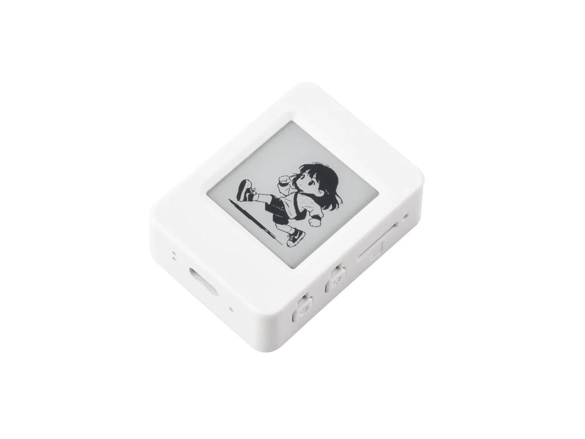

# Waveshare RP2350-Touch-ePaper-1.54 Product Engineering Sample Program

[中文](README_ZH.md)

RP2350-Touch-ePaper-1.54 is a high-performance, highly integrated MCU development board independently designed by Waveshare.It integrates large-capacity Flash and is equipped with a 1.54-inch e-paper display, featuring ultra-low power consumption and clear visibility under ambient light, making it ideal for portable devices and long-battery-life scenarios.Onboard peripherals include an RTC real-time clock, SHTC3 temperature and humidity sensor, Micro SD card slot, low-power audio codec circuit, as well as lithium battery charge and discharge management circuit.Reserved expansion interfaces such as USB, UART, I2C and GPIO support functional expansion and sensor connection, providing a flexible and reliable development platform for IoT terminals, electronic shelf labels, portable displays and other applications.

- [Purchase Link](https://www.waveshare.net/shop/RP2350-ePaper-1.54-EN.htm)
- [Documentation](https://docs.waveshare.net/RP2350-ePaper-1.54)

---

## 🔧 Configuration

You can find detailed configuration information on the product wiki page

---

## 🛠️ Contributing

We welcome contributions! Here’s how you can help:

1. Fork the repository.
2. Create a new branch for your feature or bug fix.
3. Commit your changes with clear descriptions.
4. Submit a pull request for review.

---

## 🧩 Issues and Support

If you encounter any issues:

- Check the [Issues](https://github.com/waveshareteam/ESP32-S3-Touch-LCD-4.3C/issues) section.
- Create a new issue with detailed information.
- Refer to the documentation for troubleshooting tips.
- Contact the Waveshare team and provide the order number to obtain technical support.

---

## 📜 License

This repository is licensed under the Apache License License. See the [LICENSE](LICENSE) file for details.

---

## 🙌 Acknowledgments

- Waveshare for their excellent hardware platforms and software support
- The Raspberry Pi Team for their continuous support.
- Open-source contributors who make these projects possible.

---

Thank you for using Waveshare Electronics Products! 🚀